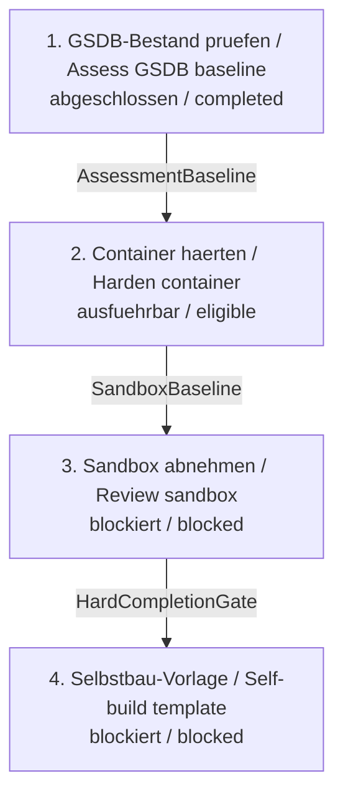

# Abarbeitungsreihenfolge der Sandbox-Intakes / Sandbox Intake Order

**Status:** aktiv / active

**Verbindliche Quelle / Binding source:** `specs/intake-series/sandbox-development-lifecycle/manifest.json`

## Zweck / Purpose

**DE:** Diese Datei erklaert die verbindliche Reihenfolge der aktiven
Sandbox-Intakes. Ein Intake ist ein geprueftes Anforderungsdokument fuer einen
spaeteren Spec-Kit-Lauf. Die Datei startet keinen Lauf. Der maschinenlesbare
Graph im Serienmanifest ist bei Abweichungen massgeblich.

**EN:** This file explains the binding order of the active sandbox intakes. An
intake is a reviewed requirements document for a later Spec Kit run. This file
does not start a run. If information differs, the machine-readable graph in the
series manifest is authoritative.

## Aktive Reihenfolge / Active Order

| Rang | Intake | Aufgabe | Status |
|---:|---|---|---|
| 1 | `Lastenheft_GSDB-Spec-Kit-Intensivpruefung.md` | GSDB-Bestand und Luecken pruefen | abgeschlossen / completed |
| 2 | `Lastenheft_Secure-Development-Container-Hardening.md` | priorisierte technische Haertung umsetzen | ausfuehrbar / eligible |
| 3 | `Lastenheft_Sandbox-Secure-Development-Selbstpruefung.md` | gehaertete Sandbox unabhaengig abnehmen | blockiert / blocked |
| 4 | `intakes/learner-fork-self-build-sandbox.md` | forkbare Selbstbau-Vorlage bereitstellen | blockiert / blocked |

## Abhaengigkeiten / Dependencies

1. Die GSDB-Bestandspruefung liefert die priorisierte Lueckenliste.
2. Die technische Haertung verwendet diese Liste als verbindliche Baseline.
3. Die Sandbox-Abnahme beginnt erst nach abgeschlossener Haertung.
4. Die Selbstbau-Vorlage wird erst nach erfolgreicher Abnahme bearbeitet.

*The GSDB assessment produces the prioritized gap list. Technical hardening
uses it as its baseline. Acceptance starts only after hardening is complete,
and the self-build template follows successful acceptance.*

## Textorientiertes Mermaid-Diagramm / Text-First Mermaid Diagram

**DE:** Die Tabelle und die nummerierte Abhaengigkeitsliste oberhalb sind die
vollstaendige Textalternative und bleiben auch ohne Diagrammdarstellung
verstaendlich. Das folgende Mermaid-Diagramm wiederholt dieselben vier aktiven
Intakes, Status und verbindlichen Kanten. Das Serienmanifest bleibt die
massgebliche maschinenlesbare Quelle.

**EN:** The table and numbered dependency list above are the complete text
alternative and remain understandable without diagram rendering. The Mermaid
diagram below repeats the same four active intakes, statuses, and binding
edges. The series manifest remains the authoritative machine-readable source.



## Archivierte oder ersetzte Lastenhefte / Archived or Superseded Requirements

- `Lastenheft_Sandbox-Public-Readiness.001-public-readiness.md` ist als
  abgeschlossene Feature-Eingabe archiviert.
- Die frueheren getrennten RL-SE-/Checklist- und allgemeinen
  Secure-Development-Hardening-Intakes sind in die GSDB-Bestandspruefung
  eingeflossen. Archive und Tombstones liegen unter `specs/`.

## Naechste Aktion / Next Action

Den Serienstatus schreibfrei pruefen. Danach darf der naechste Kandidat
ebenfalls schreibfrei angezeigt werden; keiner dieser Befehle startet Arbeit:

```text
$speckit-intake-series-status specs/intake-series/sandbox-development-lifecycle/manifest.json
$speckit-intake-series-next specs/intake-series/sandbox-development-lifecycle/manifest.json
```

<!-- secure-development-hardening-order:start -->
## Verlinkte Lastenheft-Reihenfolge / Linked Requirements Order

Diese Tabelle wird aus dem kanonischen Series-Manifest und ausdruecklicher Feature-Evidence erzeugt. Vollstaendige Dateinamen, direkte eingehende Kanten und sichtbare Positionen bleiben erhalten. Manuelle Abschnitte ausserhalb dieses Markers bleiben unberuehrt.

*This table is generated from the canonical series manifest and explicit feature evidence. Complete filenames, direct incoming edges, and visible positions are preserved. Manual sections outside this marker remain unchanged.*

| Position | Status | Lastenheft/Intake | Abhängigkeiten / Dependencies | Spec-Kit-Feature |
|---:|---|---|---|---|
| 1 | Completed | [Lastenheft_GSDB-Spec-Kit-Intensivpruefung.md](Lastenheft_GSDB-Spec-Kit-Intensivpruefung.md) | — (Root / keine direkte Abhängigkeit) | — (kein Spec-Kit-Feature / no Spec Kit feature) |
| 2 | Eligible | [Lastenheft_Secure-Development-Container-Hardening.md](Lastenheft_Secure-Development-Container-Hardening.md) | [Lastenheft_GSDB-Spec-Kit-Intensivpruefung.md](Lastenheft_GSDB-Spec-Kit-Intensivpruefung.md) → current (`AssessmentBaseline`, binding: true) | — (kein Spec-Kit-Feature / no Spec Kit feature) |
| 3 | Blocked | [Lastenheft_Sandbox-Secure-Development-Selbstpruefung.md](Lastenheft_Sandbox-Secure-Development-Selbstpruefung.md) | [Lastenheft_Secure-Development-Container-Hardening.md](Lastenheft_Secure-Development-Container-Hardening.md) → current (`SandboxBaseline`, binding: true) | — (kein Spec-Kit-Feature / no Spec Kit feature) |
| 4 | Blocked | [learner-fork-self-build-sandbox.md](intakes/learner-fork-self-build-sandbox.md) | [Lastenheft_Sandbox-Secure-Development-Selbstpruefung.md](Lastenheft_Sandbox-Secure-Development-Selbstpruefung.md) → current (`HardCompletionGate`, binding: true) | — (kein Spec-Kit-Feature / no Spec Kit feature) |
<!-- secure-development-hardening-order:end -->
